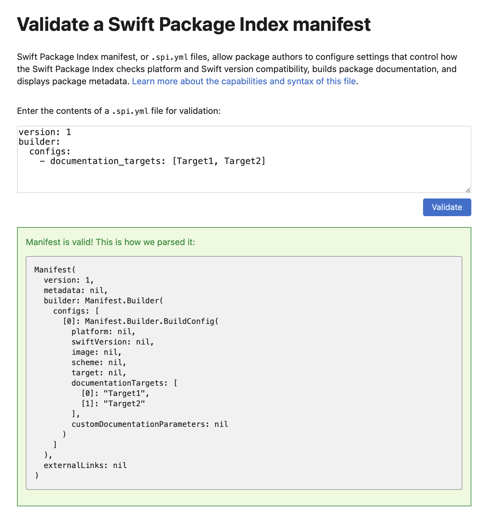

# Manifest Validation

How to validate `.spi.yml` files.

## Overview

The easiest way to validate a `.spi.yml` is via the [Online Validator](https://swiftpackageindex.com/validate-spi-manifest) on the [Swift Package Index website](https://swiftpackageindex.com).

You can also use the `validate-spi-manifest` executable to validate your `.spi.yml` file.

### Online Validator

The [Online Validator](https://swiftpackageindex.com/validate-spi-manifest) is a simple web form where you can submit your sample `.spi.yml` file and it will run the exact same parser as during package processing.

The validator will display the parsed result or error messages if it fails.



### Validation Executable

#### Installation

You can build and install the validation executable by cloning this package and running `make install`:

```sh
git clone https://github.com/SwiftPackageIndex/SPIManifest.git && cd SPIManifest
make install
```

This will copy the executable to `/usr/local/bin/`. To uninstall it, run

```sh
make uninstall
```

You can also install it using [Mint](https://swiftpackageindex.com/yonaskolb/Mint):

```sh
mint install SwiftPackageIndex/SPIManifest
```

#### Validation with the Executable

Once installed, you can run the executable with the path to an `.spi.yml` to validate it:

```sh
❯ validate-spi-manifest ~/Projects/MyPackage/.spi.yml 
✅ The file is valid.
```
